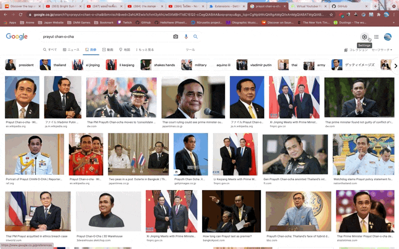
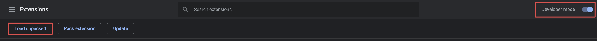

# gura-chrome-extension

 Let's change every picture to Gura with this Chrome extension!

# Idea source

 This project is getting idea from Stupid Hackathon Thailand 5 and I participate in it. But I don't have any idea to do and someone make this idea on the Discord server. That's why I make this (stupid) Chrome extension.
 
 

# Develop this extension

Clone this repository

```shell
git clone https://github.com/HelloYeew/gura-chrome-extension.git
```

Open `chrome://extensions/` on Google Chrome and open `Developer mode`, then click `Load Unpacked` and select the repositories folder.



During development process, if you make a change you must go to extension page and click `Update` button to update the change.

If you want to change a picture to other picture. Just change a picture link in [popup.js](popup.js).

If you finish and want to save this extension as one file just go to `chrome://extensions/`,click `Pack extension` and select the project directory. Then you will get `.crx` file to install or make a release of it.

You can read more about how to develop the Chrome extension on [Chrome Documentation](https://developer.chrome.com/docs/extensions/mv3/getstarted/). (This project I get the starter file from Chrome Documentation.)

# Contribution

 If you want to contribute this stupid chrome extension. You can make a pull request to make it better (or make it more stupid!).
